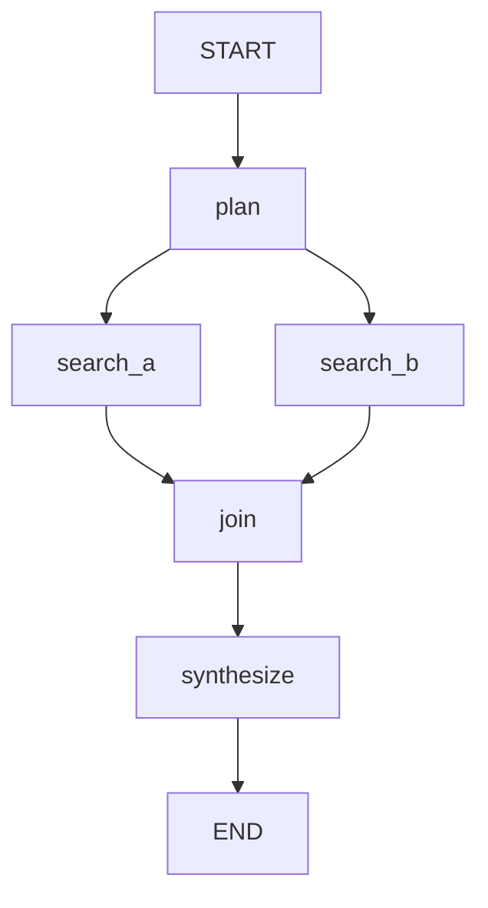

Visualize the graph structure of an ADK 2.3 `Workflow` defined in `$ARGUMENTS` (default: search the repo for the nearest module exporting a `Workflow` or `root_agent`).

Load the `adk-agentic-prod-workflows` skill first for the authoritative graph model, then inspect the target module. In ADK 2.3 the graph is built from:

- **Nodes** — functions decorated with `node()` (`google.adk.workflow._node`) and `LlmAgent` nodes.
- **Edges** — `Edge` instances (`google.adk.workflow._graph`), including conditional/branch routes. There is **no** `@edge` decorator.
- **Join** — `JoinNode` (`google.adk.workflow._join_node`) for fan-in; it waits for all named predecessors before emitting.

Steps:

1. Grep the target for `@node`/`node(`, `Edge(`, `JoinNode`, `START`, and `add_edge`/route definitions to enumerate nodes and edges.
2. Build the directed graph: fan-out = one node feeding multiple successors; fan-in = a `JoinNode` gathering predecessors.
3. Emit a Mermaid `flowchart` and a short text summary:

4. Annotate each node with its kind (`function` / `LlmAgent` / `JoinNode`), any `mode=` (`chat`/`task`/`single_turn`), and any HITL `request_input`/`interrupt_id` pause points.

Report only what the source actually defines. If a referenced node/edge symbol can't be resolved, mark it `NEEDS VERIFICATION` rather than inventing edges.
